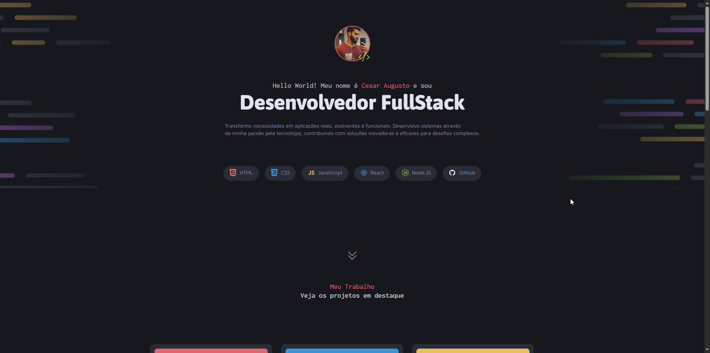

# Curso_FullStack_Rocketseat
2 Desafio -Portfólio Dev e teve um figma de referencia https://www.figma.com/design/UOgdx9NlD3nJnUizHt0ctg/Portfolio-Dev-(Community)?node-id=2148-1651&t=nGffpnB7QchIci1B-0

<h2>Foi trabalhado no decorrer desse projeto</h2>
<!--HTML-->
  

  

<!--CSS-->
  

